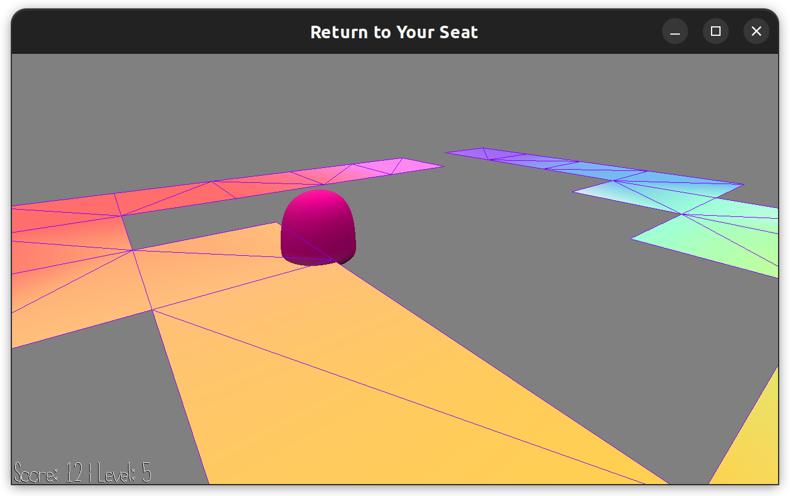

# Return to your seat!

Author: Jiyoon Park

Design: Every level, you have to collect all the Jellys and come back to your original position. The harder the level, the more jellys you have to collect. It really makes you question your memorization abilities :)  

Screen Shot:

How To Play:

- You use the uo, down, right, left arrows to naviagte aroung the map. You can also use your mouse to look around you. (Notice, you are represented by the red dot!). 

- You have to collect all the jellys and come back to your position and press __SPACE__ to move up to the next level. (You might get lucky and have no Jelly to collect! In which case, just press __SPACE__)

- If you are not in the right location, your score will go down unitl you reach 0, and die

- Press R to restart the game!

Sources: -

This game was built with [NEST](NEST.md).

